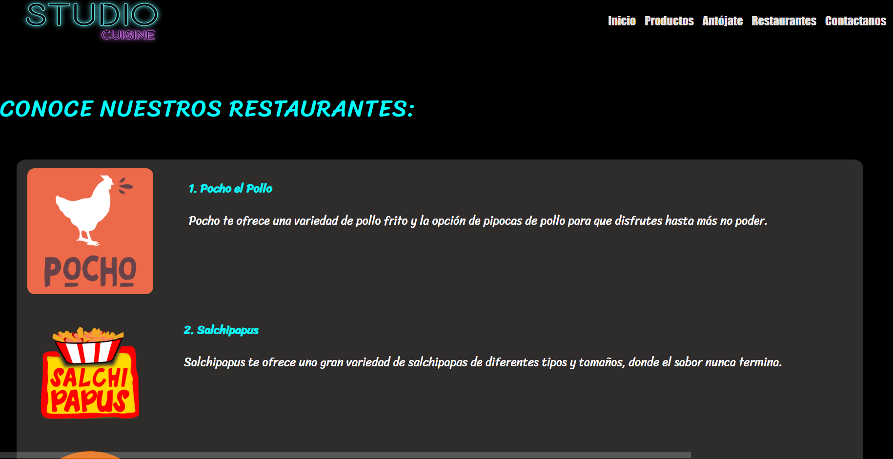
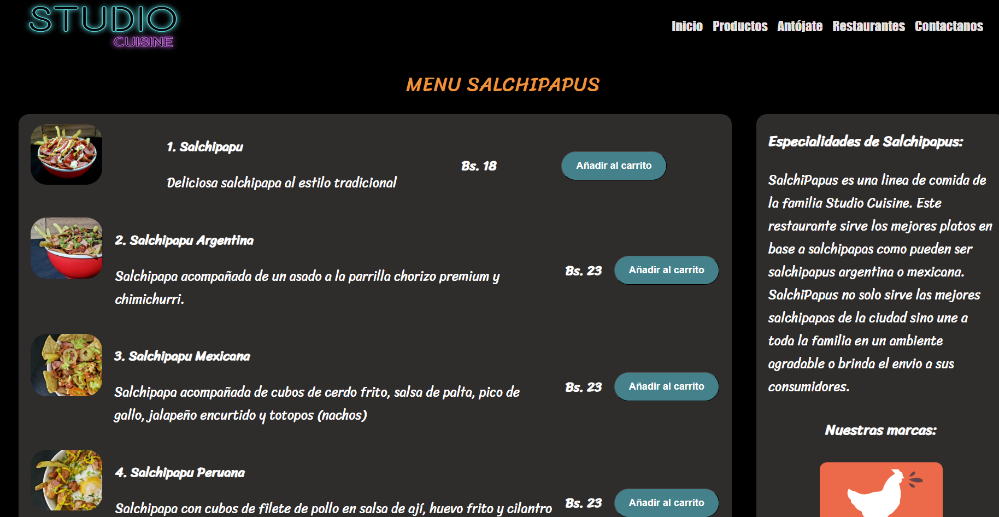
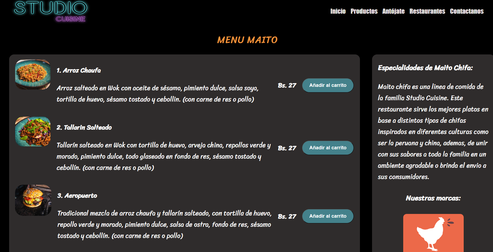
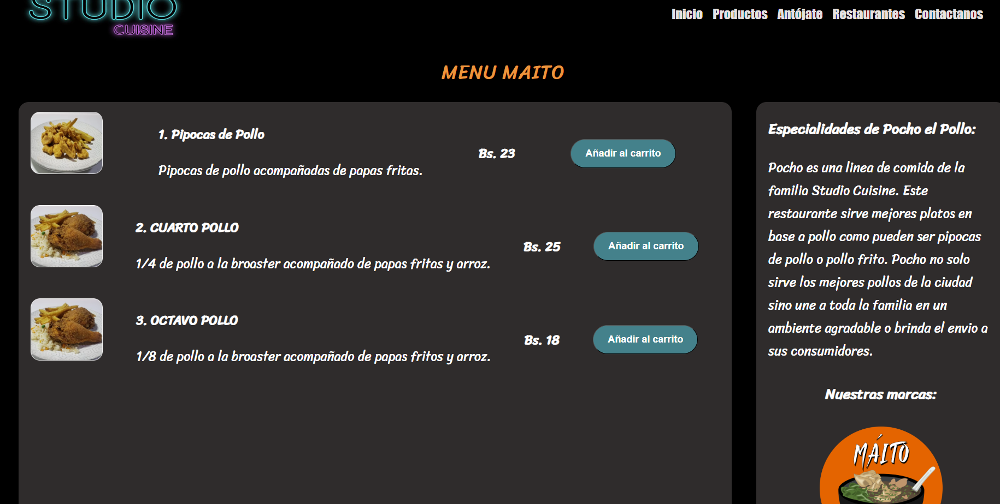
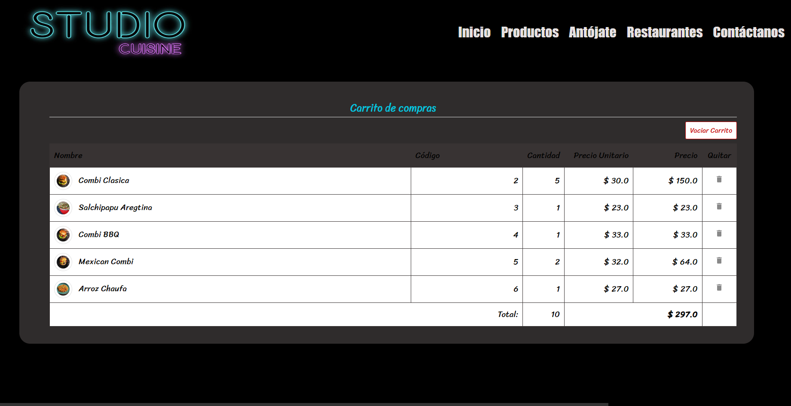
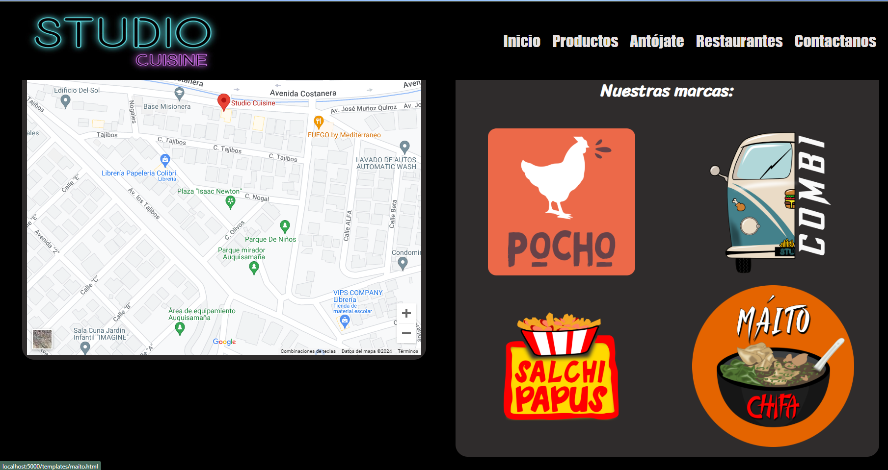
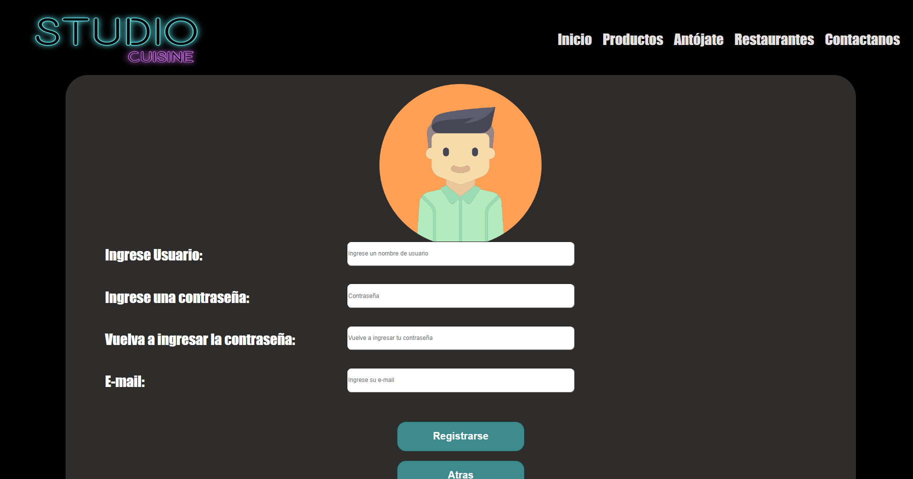
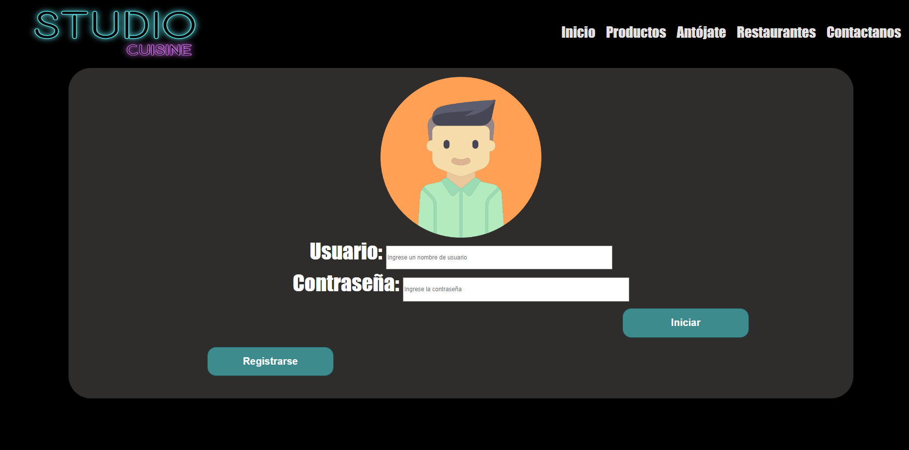
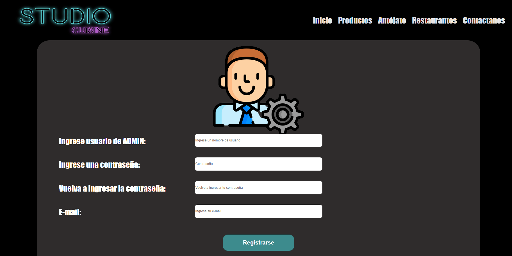
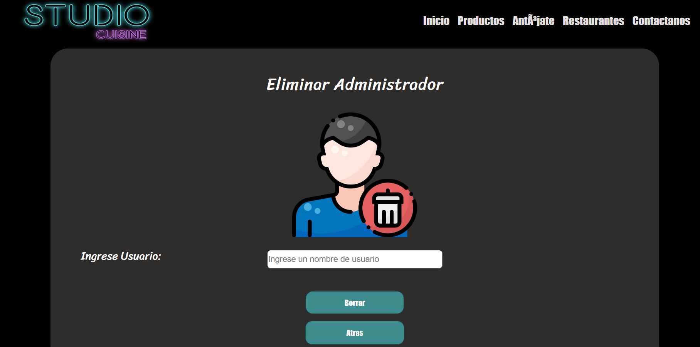

# Studio Cuisine Restaurant Menu Project

Website for managing the family of restaurants under Studio Cuisine. This project aims to provide an interactive virtual menu for customers and a management platform for the Studio Cuisine enterprise.

## Table of Contents

- [About the Project](#about-the-project)
- [Preliminary Images of the Project](#preliminary-images-of-the-project)
- [Installation](#installation)
  - [Using Docker Compose](#using-docker-compose)
- [Contact](#contact)

## About the Project

Studio Cuisine is a restaurant that manages different lines of food within a dark kitchen. The food lines include:

- **Combi**: Fast food.
- **Máito Chifa**: Peruvian Chifa.
- **Lego Burger**: Customized burgers.
- **Salchipapus**: Salchipapas.
- **Pocho el Pollo**: Fried chicken.

The objective of this project is to develop a website that allows users to explore the menus of each food line, place orders, and enable administrators to manage products and orders.

## Preliminary Images of the Project

### Home Page

The home page provides quick access to the different menus of Studio Cuisine, allowing users to select and explore each food line.


Restaurants


### Menus

The Combi, Salchipapu, Maito Chifa, Pocho el Pollo menus displays the available grilled burger options with detailed descriptions and prices.




### Shopping Cart

The shopping cart section allows users to review and modify their orders before finalizing the purchase.



### Contact Page

The contact page provides the necessary information for customers to get in touch with Studio Cuisine.




### Register a user

The registration page provides input fields to register a user



### Login page

A page where a user can user their credentials to enter into the system


### Register an admin



### Delete an admin



## Installation(With docker)

### Using Docker Compose

To facilitate the installation and configuration of the project, we will use Docker Compose. Docker Compose allows us to define and run multi-container Docker applications easily and efficiently.

#### Prerequisites

- Docker

#### Installation Steps

1. **Clone the project repository**:

   ```bash
   git clone https://github.com/CarlosFULLHD/Proyecto-Sis-Info.git
   cd Proyecto-Sis-Info/
   ```

2. **Configure Docker Compose**:

   - The `docker-compose.yml` file defines two services: one for the MySQL database and another for the Flask web application.
   - The database is initialized with the schema provided in `studiocuisine.sql`.
   - The web application is configured to run Flask in development mode.

3. **Run Docker Compose** to build and start the containers:

   ```bash
   docker-compose up --build
   ```

   This command performs the following actions:

   - Builds the Docker image for the web application.
   - Configures and starts a MySQL container, initializing it with the specified database.
   - Configures and starts a container for the Flask web application.

4. **Access the application**:
   - Once the containers are up and running, the application will be available at [http://localhost:5000](http://localhost:5000).

#### Technical Details of Docker Compose and Dockerfile

- **Dockerfile**:

  - Uses an official Python 3.10 base image.
  - Sets the working directory to `/app`.
  - Copies the requirements file and installs the necessary dependencies.
  - Copies the rest of the application to the container.
  - Exposes port 5000 and sets the startup command to run Flask.

- **docker-compose.yml**:
  - Defines two services:
    - `db`: Configures MySQL with the necessary parameters and uses the `studiocuisine.sql` file to initialize the database.
    - `web`: Builds the web application image, establishes dependencies on the database service, and exposes port 5000 for the web application.

### Installation( for local development Dockerfile)

```bash
pip install -r requirements.txt
python app/main.py
```

### issues

- sudo apt-get install libmysqlclient-dev
